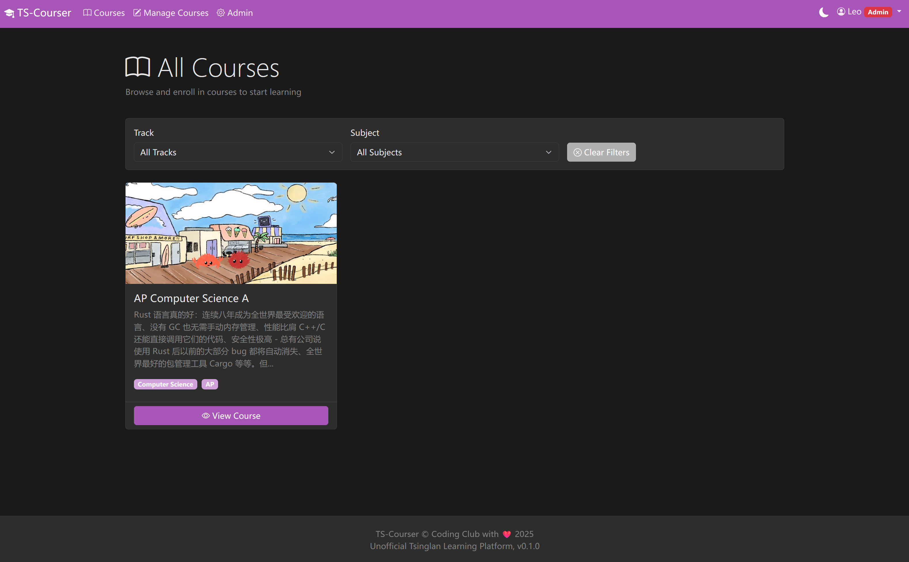

# TS-Courser

An MVP-version online learning platform inspired by Khan Academy, designed for students to browse courses, track learning progress, and practice with quizzes.

## Project Description

TS-Courser is a web-based learning management system that provides:
- **For Students**: Browse courses by tags/tracks (AP/A-Level), track reading progress, access learning materials and quizzes with PDF support
- **For Teachers**: Create and edit courses, manage sections and episodes, upload materials with markdown editor and PDF files
- **For Admins**: Manage all courses, users, and verify teacher accounts

The platform supports two types of learning episodes:
- **Material Episodes**: Learning content with markdown-rendered info pages or PDF documents
- **Quiz Episodes**: Practice problems with optional answer PDFs

## Tech Stack

### Backend
- **Framework**: Django 5.x
- **Database**: SQLite (local development)
- **Python Package Manager**: uv
- **Authentication**: Django built-in auth system with custom User model

### Frontend
- **UI Framework**: Bootstrap 5
- **JavaScript**: Native Fetch API (no jQuery)
- **Markdown Editor**: [Vditor](https://github.com/Vanessa219/vditor) (WYSIWYG editor for teachers)
- **Markdown Rendering**: marked.js
- **PDF Viewer**: PDF.js
- **Template Engine**: Django Templates

## Database Schema

### User Model (Extended AbstractUser)
```
- email (unique, for login)
- role (student/teacher/admin)
- is_verified_teacher (boolean, for teacher approval)
- + Django built-in fields (username, password, etc.)
```

### Tag Model
```
- name (unique)
- category (track/subject)
```

### Course Model
```
- title
- description
- thumbnail (optional)
- creator (FK to User)
- tags (M2M to Tag)
- is_published (boolean)
- created_at, updated_at
```

### Section Model
```
- course (FK to Course)
- title
- order (integer for sorting)
```

### Episode Model
```
- section (FK to Section)
- title
- type (material/quiz)
- order (integer for sorting)
- info_page_content (markdown text, optional)
- content_pdf (file upload, optional)
- answer_pdf (file upload, optional, quiz only)
- created_at, updated_at
```

### UserProgress Model
```
- user (FK to User)
- course (FK to Course)
- current_episode (FK to Episode, nullable)
- updated_at
- Unique together: (user, course)
```

### EpisodeReadStatus Model
```
- user (FK to User)
- episode (FK to Episode)
- is_read (boolean)
- marked_at
- Unique together: (user, episode)
```

## Business Logic

### Student Workflow
1. **Registration/Login**: Email-based registration (verification code printed to console for MVP)
2. **Course Browsing**: View published courses, filter by tags (track/subject)
3. **Course Overview**: View course details and personal progress
4. **Learning Interface**:
   - Left sidebar: Section/Episode navigation with progress indicators
   - Main area: Markdown content rendering OR PDF viewer
   - AJAX progress tracking (auto-save current position, manual mark as read/unread)

### Teacher Workflow
1. **Registration/Verification**: Register as teacher, wait for admin approval (is_verified_teacher=True)
2. **Course Management**: Create new courses, edit any existing courses
3. **Content Creation**:
   - Create sections and episodes
   - Edit markdown content with Vditor WYSIWYG editor
   - Upload PDF files (with file validation and content screening)
4. **Preview Mode**: Access same learning interface as students with additional edit buttons

### Admin Workflow
- Use Django Admin interface to:
  - Approve teacher verification requests
  - Manage all courses, sections, episodes
  - Manage all user accounts

## URL Structure

```
/accounts/
    register/          # User registration
    login/             # User login
    logout/            # User logout

/courses/
    /                  # Course list with tag filters
    <id>/overview/     # Course overview with progress
    <id>/learn/        # Learning interface (redirects to last episode)
    <id>/learn/<eid>/  # Specific episode view

/teacher/
    courses/                    # Teacher course list
    courses/create/             # Create new course
    courses/<id>/edit/          # Edit course
    sections/create/            # Create section
    episodes/create/            # Create episode
    episodes/<id>/edit/         # Edit episode (with Vditor)

/api/
    progress/update/   # AJAX: Update current episode
    progress/mark/     # AJAX: Toggle read/unread status
    upload/            # File upload for Vditor images

/admin/                # Django admin panel
```

## Permission System

### Decorators/Mixins
- **Student Access**: `@login_required` + `role in ['student', 'teacher', 'admin']`
- **Teacher Access**: `@login_required` + `role == 'teacher'` + `is_verified_teacher == True`
- **Admin Access**: `@login_required` + `is_staff == True`

## File Upload Strategy

1. Receive file → Validate MIME type
2. Content screening (check file headers, virus scan placeholder)
3. Rename with unique identifier: `{uuid}_{timestamp}.{ext}`
4. Store in `MEDIA_ROOT/episode_pdfs/` or `answer_pdfs/`
5. Save file path to database FileField

## Setup Instructions

### Prerequisites
- Python 3.13+
- uv package manager

### Installation

1. Clone the repository:
```bash
git clone <repository-url>
cd TS-Courser
```

2. Install dependencies with uv:
```bash
uv sync
```

3. Run migrations:
```bash
uv run python manage.py migrate
```

4. Create superuser (admin):
```bash
uv run python manage.py createsuperuser
```

5. Run development server:
```bash
uv run python manage.py runserver
```

6. Access the application:
- Main site: http://localhost:8000
- Admin panel: http://localhost:8000/admin

## Features & Development Status

### Implemented Features (MVP)
- [x] Database schema design with Django ORM
- [x] User authentication system (email-based login)
- [x] Role-based access control (student/teacher/admin)
- [x] Course browsing with tag filtering (track/subject)
- [x] Course overview with personal progress tracking
- [x] Learning interface with sidebar navigation
- [x] AJAX-based progress tracking (current episode, read status)
- [x] Teacher course management (create/edit courses)
- [x] Section and episode management with drag-and-drop reordering
- [x] Markdown editor (Vditor) for content creation
- [x] PDF file upload and viewing (PDF.js)
- [x] Tag creation modal with AJAX support
- [x] File upload with MIME type validation
- [x] Admin approval workflow for teachers

### Future Enhancements
- [ ] User progress tracking (enhanced)
- [ ] Email verification with real SMTP service (SSO of teams accounts)
- [ ] Advanced quiz features (interactive questions, auto-grading, etc., need ask Mr. Cao)
- [ ] Student discussion forums (or course comments)
- [ ] Course rating and review system (maybe, or student can share solutions to question)
- [ ] Mobile responsive improvements
- [ ] PostgreSQL migration for production deployment (currently using SQLite for simplicity)

## Contributing

This is an MVP project. Contributions welcome for bug fixes and feature enhancements.

## License

TBD
