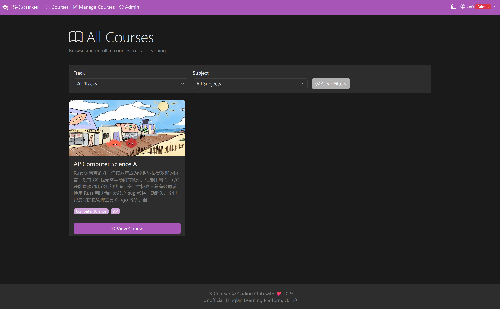

# TS-Courser



TS-Courser is a Django learning platform for small school classes. Students enroll in courses, read materials, answer quizzes, and run Python in the browser. Teachers author lessons, monitor progress, and review submissions.

This README describes the current working tree as of **2026-09-07**.

## Current features

| Area | Implemented behavior |
| --- | --- |
| Accounts | Single-tenant Microsoft Entra login for `tsinglan.org`, administrator-issued local student/admin accounts, mandatory first-login username/password replacement, teacher approval, profiles, avatars, and favorite tags |
| Courses | Published course catalog with track/subject filters; open or eight-character code enrollment; enrollment closure; course dashboard, My Courses, and resume learning |
| Authoring | Course/section/episode creation and editing, Markdown editor, PDF uploads, thumbnails, tags, and section/episode drag-and-drop ordering |
| Progress | Last visited episode, read/unread status, per-student completion percentages, and a teacher progress distribution |
| Quizzes | Single choice (MCQ), multiple response (MRQ), free response (FRQ), sorting (SRT), and code assembly (CBA); visual authoring, required-answer validation, objective-answer checking, FRQ grading, and result release |
| Python practice | Monaco editor, Pyodide worker, run/stop, `input()`, local drafts, server upload, formal submission, optional input/output test cases, starter code, and reference sheets |
| Interactive output | The `courser` Python library displays values and maps in the lesson's interactive panel |
| Teacher review | Submission lists, quiz review and release/cancel/reset actions, and inspection of submitted code and browser-reported test results |
| Administration | Django admin for users, teacher approval, and course data |

### Episode types

- **Material** (`material`): Markdown information and optional content PDF.
- **Quiz** (`quiz`): Interactive questions authored in quiz Markdown or the visual editor.
- **Code** (`code`): Python editor, optional tests, starter code, interactive display, and reference panel.
- **Paper** (`paper`): Paper PDF and optional answer PDF.

New sections and episodes append to their parent. Reorder them on the course editing page; the episode editor has no numeric order input. Teachers edit their own courses; admins bypass ownership checks.

### Submission and progress semantics

Read progress indicates completion activity, not demonstrated mastery. Quiz and formal code submission mark an episode as read.

Quiz release is configured per episode: inherit the course default, require manual release, or release immediately. Inherited automatic release excludes quizzes containing FRQs. Immediate release also applies to FRQs; a reference answer is not a teacher grade. Manual release requires all FRQs to be graded. Changing submitted answers clears earlier manual grades and recalculates release status; stale teacher review requests are rejected. Unreleased student question data omits answer keys and code-assembly solution positions.

Code saves automatically to browser local storage every 60 seconds. **Upload** saves the latest code to the server without making it a formal teacher-visible submission. **Submit** records code and test results for teacher review. There is currently one code record per student/episode: uploading again resets its formal submission state. Quiz submissions also retain only one current record, rather than attempt history.

## Local setup

Requirements: Python 3.13+, [uv](https://docs.astral.sh/uv/), Node.js/npm (CI uses Node 22), and libmagic on non-Windows systems. On macOS use `brew install libmagic`; on Debian/Ubuntu install `libmagic1`. Windows uses the Python dependency `python-magic-bin`.

```bash
git clone https://github.com/Tsinglan-Coding-Club/ts-courser.git
cd ts-courser
uv sync
npm install
uv run python manage.py migrate
uv run python manage.py createsuperuser
uv run python manage.py runserver
```

The bare `runserver` command is customized to use **8712**. Open [the application](http://localhost:8712/) or [Django admin](http://localhost:8712/admin/). To choose a port explicitly:

```bash
uv run python manage.py runserver 8000
```

Create a course from the teacher interface using an admin or verified teacher account, add episodes, and publish it for student access. There is no automatic demo-data import during setup.

`uv sync` installs the Python dependencies, including Django and MSAL from `uv.lock`. Microsoft login is disabled locally until `MS_ENTRA_CLIENT_SECRET` is provided; its production redirect URI is intentionally fixed in the deployment configuration. `npm install` supplies Monaco and Pyodide assets used by Django staticfiles. Bootstrap, Vditor, marked.js, and PDF.js are used by the templates; local setup is not a fully offline bundle.

## Development and checks

Use `uv`, not pip or Poetry. See [CLAUDE.md](CLAUDE.md) for implementation conventions.

```bash
uv run python manage.py check
uv run python manage.py test
npm test
uv run python -m unittest discover -s tests
uv run python manage.py makemigrations --check --dry-run
uv run python manage.py collectstatic --noinput --dry-run
```

The independent Python tests under `tests/` require the separate unittest command. JavaScript tests include runtime/Pyodide coverage. CI runs these checks plus the production settings check; see [.github/workflows/checks.yml](.github/workflows/checks.yml).

## Repository map

| Path | Responsibility |
| --- | --- |
| `accounts/` | Local and Microsoft authentication, external identity mapping, teacher approval, first-login credential setup, profiles, and account administration |
| `courses/` | Course hierarchy, catalog and learning views, canonical server quiz parser/validation in `quiz.py` |
| `progress/` | Enrollment, read progress, quiz/code submissions, test-result payload validation |
| `teacher/` | Authoring, ordering, student management, assignment review, ownership decorators |
| `templates/` | Django pages; lesson tabs under `courses/episodes/` |
| `static/js/`, `static/python/` | Quiz editor, Python execution and interactive display, bundled `courser` library |
| `ts_courser/` | Settings, routes, upload utilities, cross-origin isolation middleware |
| `docs/`, `tests/` | Guides/design records and standalone Python tests |

## Deployment and current boundaries

Use [DEPLOYMENT.md](docs/DEPLOYMENT.md) and `.env.example` for production settings, HTTPS/static assets, and backups. `.env` is **not loaded automatically**. The production profile requires environment-provided secret and hostnames; changing the development settings file is not the deployment procedure.

The current classroom scope retains these documented boundaries:

- Python tests execute in the student's browser. The server validates the result payload's structure but does not independently rerun code; results are classroom feedback, not tamper-proof grades.
- Teacher-authored Markdown is rendered as HTML under the assumption that verified teachers are trusted. Sanitization for untrusted/imported content remains deferred.
- Image uploads decode and re-encode JPEG/PNG/GIF/WebP with size and pixel limits. The inline upload endpoint requires login; its content-author ownership policy remains undecided.
- Microsoft sign-in currently validates the fixed tenant, application audience, v2 issuer, school principal-name domain, and required `acct=0` member claim. Entra disable/removal synchronization and automatic account linking are intentionally not in the first release.

## Documentation and planned work

- [Contributor guide](CLAUDE.md)
- [Adding an episode type](docs/ADD_EPISODE_TYPE.md)
- [Interactive Python API and example](docs/INTERACTIVE_AREA.md)
- [Deployment](docs/DEPLOYMENT.md)
- [Prelaunch review and subsequent repair status](docs/PRELAUNCH_REVIEW_2026-09-05.md)
- [School account upgrade plan](docs/ACCOUNT_SYSTEM_UPGRADE_PLAN.md)
- [Account administration UI specification](docs/ACCOUNT_ADMIN_UI_SPEC.md)
- [Microsoft identity research](docs/MICROSOFT_IDENTITY_RESEARCH.md)
- [Functional assessment and proposed priorities](docs/FUNCTIONAL_ROADMAP.md)

## Contributing and license

Follow [AGENTS.md](AGENTS.md) and [CLAUDE.md](CLAUDE.md), include migrations for model changes, and add regression coverage for new views/business logic. Use Conventional Commit prefixes and `feat/<topic>` feature branches.

A repository-wide license has not yet been established. The `ISC` metadata in `package.json` does not replace a project license file.
