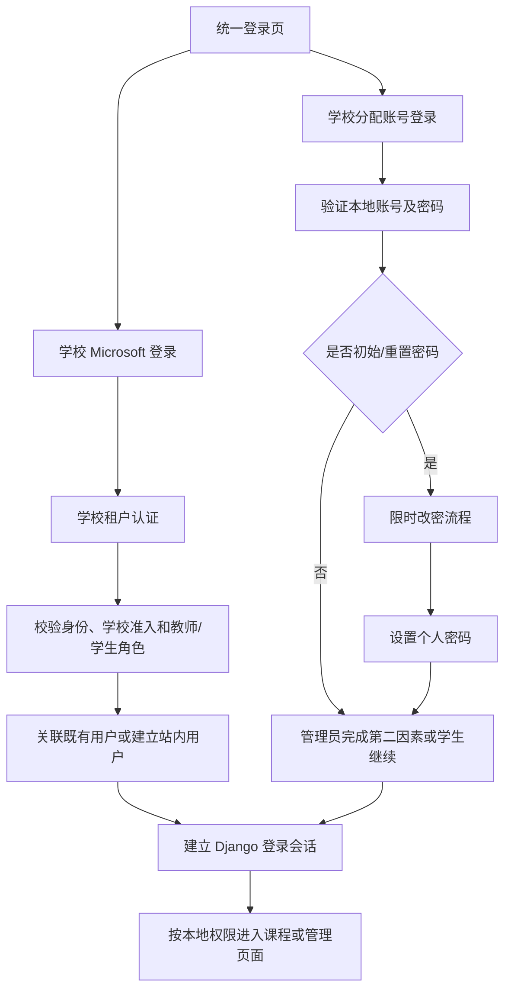

# TS-Courser 校内账号系统升级方案

调研日期：2026-09-03。状态：2026-09-07 已实施第一版核心流程，包括关闭公开注册、单租户 Microsoft 登录、Guest 拒绝、教师首次登录待审核、单个本地学生发号、首次强制改用户名和密码及受控管理员初始化。批量发号、Entra 停用同步和自动身份关联仍未实施。Microsoft 接口事实与来源见 [Microsoft Entra ID 调研](MICROSOFT_IDENTITY_RESEARCH.md)，后续批量发号页面与接口详见 [管理员界面规格](ACCOUNT_ADMIN_UI_SPEC.md)。

已确认的需求：全体师生均有学校 Microsoft 账号；小学生的本地账号是便于使用的另一种登录方式。当前用户全部是测试账号，无需迁移。学生学校邮箱按 `Firstname_Lastname_Graduationyear@学校后缀` 命名，教师邮箱不带毕业年份。学生数据由管理员在产品界面录入或导入，不是用户需要提供给开发者或 AI 的接入资料。学校使用 Teams、Outlook；实际租户 ID 和云环境仍由 IT 确认。

## 1. 建议采用的账号规则

继续使用现有 `accounts.User` 模型，在同一套课程、进度和权限系统上支持两种认证方式：Microsoft 学校身份认证，以及管理员创建的本地账号。新系统从干净的账号数据开始，不建设旧账号迁移流程。

| 使用者 | 登录方式 | 如何获得账号 | 密码与权限由谁管理 |
| --- | --- | --- | --- |
| 全体教师、学生（含小学生） | Microsoft Entra ID 单租户登录 | 首次通过学校认证和准入检查后，建立或关联站内用户记录 | Microsoft 管理密码；学校配置或管理员确认教师身份，平台管理课程权限 |
| 小学生的便捷登录 | 学校分配的用户名＋密码 | 仅平台管理员通过表单、粘贴或文件导入单个/批量创建 | 系统自动生成用户名与独立初始密码；首次登录必须改密；忘记后由管理员重置 |
| 平台管理员 | 管理员用户名＋密码 | 仅现有平台管理员创建；首个管理员由受控部署命令初始化 | 本地维护；建议生产环境同时要求第二因素和恢复码 |

关闭公开注册、邮箱验证码、通过邮箱找回密码等入口。邮箱如果保留，只作为可选联系资料，不再承担身份绑定、登录或授权功能。教师不能创建、重置或导出小学生账号密码；学校 IT 的 Entra 管理权限也不自动等于本平台管理员权限。

Microsoft 认证只证明身份。允许访问本平台还必须满足学校准入规则；角色不能由登录表单或用户自行声明。邮箱命名只辅助分类，不作为身份主键，也不单凭“缺少毕业年份”授予教师权限。



## 2. 调研时的代码与升级影响（2026-09-03）

以下表格保留调研时的基线。2026-09-05 文档复核：账号图片上传已有校验与回归测试，因此“账号测试仍为空”不再是当前事实；该测试更新不表示 Microsoft 登录或发号功能已实施。当前功能以 [README](../README.md) 为准。

| 调研时事实 | 对升级的影响 |
| --- | --- |
| [User 模型](../accounts/models.py) 继承 `AbstractUser`，没有改写 `USERNAME_FIELD`；[登录视图](../accounts/views.py) 调用 `authenticate(username=..., password=...)` | 实际是用户名密码登录；贡献者文档所写的“邮箱登录”不准确。复用现有用户名认证基础 |
| `email` 必填且唯一；公开注册使用邮箱验证码 | 改为可选、非唯一联系字段，小学生发号无需填写学校邮箱；移除验证字段和注册路由 |
| 注册直接将 `request.POST['role']` 写入用户，未做角色白名单限制 | 客户端可以提交 `admin`，必须优先关闭旧注册服务端入口；新管理员统一走受控创建 |
| `is_admin` 为 `role == 'admin' or is_staff`；教师功能使用该属性绕过课程所有权检查 | 必须分清平台管理权、Django 后台准入和超级用户；不能把后台操作员自动变成全平台管理员 |
| 登录成功直接跳转用户给出的 `next`；登出允许 GET | 改为站内目标校验，登出采用有 CSRF 保护的 POST；Microsoft 回跳与站内 `next` 分开管理 |
| 没有首次改密、密码重置业务、批次管理或账号审计；[账号测试](../accounts/tests.py) 仍为空 | 这些是本次升级的核心交付内容 |
| [Django 后台](../accounts/admin.py) 已有用户编辑与教师审核动作 | 可继续作为运维后台；学校日常批量发号另建专用页面，并统一使用账号服务，避免后台绕过限制 |
| [课程](../courses/models.py) 与 [进度、选课、答题、代码提交](../progress/models.py) 均通过用户外键关联 | 继续按站内 `User.id` 管理学习数据；未来同一学生关联第二种登录方式时使用同一个用户 |
| [教师学生管理页](../templates/teacher/course_manage.html) 显示邮箱；[导航](../templates/base.html) 有注册和 Django admin 链接 | 调整为姓名、班级、校内编号/登录名，并新增“账号管理”和“账号安全”入口 |
| [中间件](../ts_courser/middleware.py) 设置 COOP/COEP 以支持 Pyodide | Microsoft 登录使用整页跳转；保留代码运行器需要的隔离策略 |
| `uv.lock` 当前锁定 Django 5.2.7，尚无 Microsoft/OIDC 依赖 | 新增依赖时通过 `uv` 锁定、核验受支持版本；Django 安全维护更新与账号改造一起安排验证 |

本次调研没有读取实际学生数据，也没有修改账号、数据库或上述业务代码。以上代码风险来自静态检查，不是对运行服务的攻击测试。

## 3. Microsoft 接口与准入设计

### 3.1 接口选择

采用 **Microsoft Entra ID workforce tenant + OpenID Connect + Authorization Code Flow + PKCE**。注册平台类型选 **Web**，支持的账号类型选 **Accounts in this organizational directory only**。服务端保存应用凭据、兑换授权码；浏览器通过 Django session 使用平台。[Microsoft 授权码流程](https://learn.microsoft.com/en-us/entra/identity-platform/v2-oauth2-auth-code-flow)

第一版只需要登录，协议权限从 `openid profile` 开始。无需为了登录读取 Outlook 邮件、通讯录或班级，也无需先申请 Graph `User.Read`、目录读权限或长期代理访问权限。SDK 自动追加的 scope 仍需检查，特别是 `offline_access`；具体 MSAL 参数和版本边界见调研文档。[OIDC scopes](https://learn.microsoft.com/en-us/entra/identity-platform/scopes-oidc)

建议使用 MSAL Python 管理授权流程，并在集中式回调验证模块中明确验证 ID token。不假设“拿到 `id_token_claims`”就已完成全部验证；选用版本的行为须按官方文档和源码确认。采用严格验证路径：使用受维护的 JWT/JWKS 验证库，例如 PyJWT 的密码学支持，验证签名、预期 issuer、audience、有效期及 nonce，再验证固定学校 `tid` 和 `oid`。JWKS/discovery 只来自预配置的学校云端点，算法采用明确允许列表，不能接受 token 自带任意地址作为密钥来源。[Microsoft ID tokens](https://learn.microsoft.com/en-us/entra/identity-platform/id-tokens)、[PyJWT 官方用法](https://pyjwt.readthedocs.io/en/stable/usage.html)

### 3.2 “只允许学校人员”的两层门槛

**第一层：身份来源。** 使用固定 tenant authority，验证 token 来自配置的租户和应用。单租户仍允许本租户中的 guest，因此不能把“同一个租户”或“同一个邮箱后缀”当作在校证明。[Single-tenant apps](https://learn.microsoft.com/en-us/entra/identity-platform/single-and-multi-tenant-apps)

**第二层：学校准入。** 推荐学校 IT 给该应用定义 `Student`、`Teacher` 两个 app role，将合格用户分配到角色，并启用 Enterprise application 的 Assignment required。应用本身仍校验允许的角色和校内成员资格，拒绝 guest、未分配人员、缺失/冲突角色；不从 Entra 的目录管理员身份推导平台管理员。[App roles](https://learn.microsoft.com/en-us/entra/identity-platform/howto-add-app-roles-in-apps)

若学校无法持续维护 app role，可选本地准入名单模式：管理员通过产品界面确认已验证的 `(tenant_id, object_id, 本地角色)`，获准后才进入业务页面。也支持文件导入，但不强制提前准备整校名单。

不要求用户把名单交给开发者；需要维护准入名单时，在平台管理员界面完成。若学校希望全体在校成员首次登录即可使用，也可由 IT 明确确认范围后选用“学校成员准入＋本地教师审核”模式：通过租户与在校资格检查的人先只有学习权限，无年份的账号提示申请教师审核，审核通过才启用教师功能。三种准入策略必须显式选定，不能在配置出错时自动互相回退。

若采用首次登录待审核或学校成员准入模式，Entra 的 Assignment required 设置必须与之配合：未被分配的普通用户会在回到本站前被 Entra 阻止。学校可先为合格成员分配 Default Access，或在明确采用本站准入策略时关闭该开关。不能同时要求未分配账号被 Entra 阻止，又期待这些账号能够进入本站的审核页面。

本方案默认排除 guest：学校在 ID token 中配置可选 `acct` claim，应用明确要求 `acct == 0`，值为 `1` 或缺失都拒绝；不能假定普通 ID token 必然包含 `userType`。这个要求同样适用于本地准入名单模式。即使是目录 member，是否属于实际在校人员仍由学校授权名单负责。若学校确实把校内教师登记为 guest，需要在实施前单独核实业务规则。[Optional claims](https://learn.microsoft.com/en-us/entra/identity-platform/optional-claims-reference)

组分配的 P1/P2 许可与逐个用户分配有所区别，应先核实学校已有许可和维护方式。Assignment required 还有 Global Administrator 等例外，因此本站必须自行检查教师/学生准入，不能只依赖该开关。[Enterprise app access](https://learn.microsoft.com/en-us/entra/identity/enterprise-apps/what-is-access-management)、[Assignment required 例外](https://learn.microsoft.com/en-us/troubleshoot/entra/entra-id/app-integration/error-code-aadsts50105-user-not-assigned-role)

**学校邮箱命名的具体用途。** 在学校认证完成后，对学校指定的登录标识字段执行完整匹配：先核对学校后缀，再识别本地部分末尾的 `_毕业年份`；姓名段允许学校实际命名规则中的字符，不按“恰好两个下划线”猜测姓名。四位年份只是暂定格式，正式规则由 IT 确认。匹配结果保存为学生身份提示和毕业年份资料，不能由浏览器提交的邮箱产生权限。

有毕业年份时可建议学生类别；无年份、无法识别或字段缺失时标记为未确认，不能反向推断为教师。可信 app role 与命名提示冲突时记录告警，由管理员核查，命名提示不覆盖权威角色。毕业年份不自动等于当前年级、在校资格或离校日期。token 中的 `email`、`preferred_username` 与实际收信邮箱可能不同，最终采用哪个学校管理的字段须经 IT 确认；不因姓名/邮箱更改新建用户，也不自动升级权限。[Microsoft ID-token claims](https://learn.microsoft.com/en-us/entra/identity-platform/id-token-claims-reference)

### 3.3 一次登录的服务器处理

1. 登录发起接口验证并保存站内 `next`，创建短时、一次性的 `state`、nonce、PKCE flow；放在服务端 session 中。
2. 整页跳转 Microsoft 授权端点；使用授权码响应及 GET/query 回调。这样可配合顶层导航和 `SameSite=Lax` cookie，不必为了跨站表单回调全局放松 CSRF。
3. 回调消费对应 flow，拒绝过期、重放、缺少会话或 state 不匹配的请求；服务端兑换 code，完成 token 验证。回调不能接受浏览器传来的任意 token 作为登录依据。
4. 校验学校准入、角色、本地停用状态。失败时显示清晰的学校账号/权限提示，日志只留诊断编号与必要错误类别。
5. 根据 `(tid, oid)` 找到外部身份映射；命中则使用同一个 `User.id`。没有映射时进入首次使用页：已有学校分配账号的人可验证本地凭据并关联，其他已获准入资格的师生可建立站内记录。仅 Microsoft 登录的用户使用不可用本地密码。
6. 更新允许同步的资料与角色，建立 Django session，跳转已验证的站内目标。回调页立即清除地址栏中的授权参数，不加载第三方分析脚本，不记录完整 code/token。

全流程不以 email/UPN 自动合并账号。Microsoft 账号更名时仍通过原 `(tid, oid)` 找回学习数据。[Microsoft 身份 claims](https://learn.microsoft.com/en-us/entra/identity-platform/access-token-claims-reference)

实现额外 nonce 验证时，要比较实际发往授权端点的 nonce；MSAL 1.38.0 会对 flow 内保存的 nonce 做 hash 后发送，不能直接把 token claim 与 flow 内原始值比较。该行为已在调研文档固定源码中核实。

### 3.4 学校 IT 的应用配置交付

| 配置项 | 目标 |
| --- | --- |
| 应用和环境 | 测试、生产建议使用独立应用注册，各自保存 Tenant ID、Client ID、凭据及到期责任人 |
| Web 回调 | 生产为 `https://<正式域名>/accounts/microsoft/callback/`；测试域名单独登记；本地开发登记对应 localhost Web URI |
| 认证流程 | 使用服务端授权码流程；不启用 implicit token 返回，不作为 SPA/public client 配置 |
| 身份与角色 | 固定学校租户；启用 ID-token `acct`；显式选定 app roles、本地准入名单或学校成员准入＋本地教师审核策略 |
| 企业应用 | 配置用户分配及必要的管理员同意，使用测试师生和未分配人员验证实际结果 |
| 凭据 | 服务器证书或 client secret；秘密进入部署机密存储，管理页只显示状态与到期信息 |
| 服务器配置 | cloud/authority、Tenant ID、Client ID、credential 引用、固定 callback URI、授权策略模式；发现/JWKS 端点从已知学校云获取 |

仅登录不需要让学校交付整个目录，也不要求学校把 Microsoft 用户密码提供给平台。应用注册、同意及分配需要学校 IT 实际操作，光有一个学校邮箱地址不足以完成集成。

## 4. 需要你和学校 IT 提供的信息

学校 Microsoft 账号已覆盖全体师生、无需旧数据迁移，这两项不再询问。学生名单和账号发放数据由管理员在产品中自行管理，无需提供给开发者。接入所需的是学校配置；应用尚未注册时，Client ID 可以在实施阶段补齐。

| 信息 | 谁提供 | 用途 / 是否必须现在提供 |
| --- | --- | --- |
| 学校邮箱后缀、毕业年份位数、特殊姓名规则、邮箱与登录 UPN 是否一致 | 学校 IT | 配置命名识别；仅需规则或虚构样例，无需真实师生地址 |
| 学校使用全球云还是世纪互联中国云 | 学校 IT | 决定认证端点；学校所在地不能代替这一答案 |
| Directory / Tenant ID | 学校 IT | 固定学校租户；可分享的标识符，不是密码 |
| 能注册应用、分配用户/角色、完成必要同意的 IT 联系人 | 学校 | 确保可以实际开通并维护；平台管理员与该联系人可以不是同一人 |
| 当前许可是否支持所需组分配、是否已有师生组及其 object ID | 学校 IT | 决定角色分配方式；不预设必须购买新许可 |
| 正式域名、测试域名、部署环境、是否位于反向代理后 | 你、运维 | 登记精确 HTTPS 回调地址，配置 cookie/CSRF/代理；本地开发单列 URI |
| 教师/学生资格的权威来源；访客、毕业生、离职人员如何处理 | 学校 | 决定 app roles 或本地准入名单，以及停用生效时限 |
| 初始密码如何发放，忘记密码找谁，是否允许教师转交纸质账号卡 | 学校 | 教师可协助分发，但账号创建和重置权仍只给管理员 |
| 管理员初始化、发号和账号恢复由谁负责 | 学校、运维 | 明确操作责任；真实管理员资料在部署命令或管理员界面录入 |
| 学校电脑是否共用、是否允许长时间保持登录、界面语言 | 你、学校 IT | 确定会话时限、切换账号和儿童使用文案 |
| Application / Client ID、Enterprise application 标识、Web 回调登记结果 | 学校 IT | 应用注册后提供；均不是 client secret |
| 客户端证书/密钥的部署方式、到期时间和轮换责任人 | 学校 IT、运维 | 实施时在服务器配置；密钥内容不需要贴在聊天或文档中 |

建议回填：

```text
学校 Microsoft 云：全球 / 世纪互联 / 暂不清楚
学校 Tenant ID：
IT 对接人及可协助的配置：
学校邮箱后缀与毕业年份格式：
邮箱与 Microsoft 登录 UPN 是否一致：
教师权限来源：学校应用角色 / 平台管理员审核
学校成员准入：应用分配 / 平台名单 / 已确认的全体在校成员
正式及测试域名：
离校停用期望多久生效：
管理员及发号/重置负责人：
```

## 5. 数据与权限模型

以下名称是拟议设计，实施时可按项目风格调整；不更换 `AUTH_USER_MODEL`。

| 模型/字段 | 设计 |
| --- | --- |
| `User.id`、`username` | 站内学习档案主键与唯一登录名；新用户名自动生成且稳定，不因升班或邮箱更名改变 |
| `User.local_login_enabled` | 是否允许本站密码认证；只对管理员创建的小学生和管理员启用。Microsoft 身份是否可用由 `ExternalIdentity` 决定，两者不互斥 |
| `User.role` | 保留 `student` / `teacher` / `admin`；与认证方式分开。首版允许 local student、local admin、Microsoft student/teacher |
| `User.role_source` | `local_admin` / `entra_app_role` / `member_default`，记录角色来源；无毕业年份不能作为教师授权来源 |
| `User.email` | `blank=True`、非唯一；空值统一为 `''`。不参与登录、找回、自动绑定 |
| `User.must_change_password`、`initial_password_expires_at`、`password_changed_at` | 管理初始/重置密码生命周期；仅用于本地账号 |
| `User.auth_version` | 每次停用、重置、关键角色变更、登录方式切换或“退出全部设备”递增；每个会话携带版本并检查 |
| `User.created_by`、`is_active` | 记录创建者；停用代替直接删除有学习记录的用户。首个管理员的创建来源记为受控初始化 |
| `ExternalIdentity` | `user`、`provider`、`tenant_id`、`object_id`、资料快照、最近认证时间；唯一约束 `(provider, tenant_id, object_id)`，首版每个 user 最多一个 Entra identity |
| `SchoolIdentityHint` 或对应档案字段 | 可选学校地址、分类提示、毕业年份、待教师审核状态。地址是关联候选信息，不是已验证的外部身份 |
| `ApprovedIdentity`（名单模式时） | 允许的 `(tenant_id, object_id)`、角色、在校资格核验来源、有效期/停用状态；支持尚未首次登录的人员 |
| `SchoolClass`、`StudentProfile` | 班级、学年、可选学号和自动内部编号。学号与公开显示名分开，升班更新班级而不重建用户；历史变更记审计 |
| `AccountBatch`、批次明细 | 操作者、导入摘要、幂等键、结果/错误、关联用户、发放状态；不存明文密码 |
| `AccountAuditEvent` | 操作者、对象、动作、时间、原因、必要的前后值和请求标识；不能写入密码、授权码、token 或证书私钥 |

新增服务端约束：本地学生必须按小学生发号流程创建；本地教师账号不开放；Microsoft 登录不会创建管理员。账号创建、重置、角色修改、绑定和停用集中到账号服务中，Web、Django admin 和命令行调用相同规则。

`is_admin` 建议定义为 `role == 'admin' or is_superuser`，移除 `is_staff` 的业务越权含义。`is_staff` 仅控制 Django 后台准入，具体模型操作依赖 Django permission。普通平台管理员默认使用专用管理台，无需成为 `is_staff` 或 `is_superuser`。对所有使用 `is_admin` 的课程所有权检查、导航和后台动作一起回归验证。

现有 `is_verified_teacher` 可继续作为教师审核标志：由可信 app role 或管理员审核设置，用户不能自己修改。与全部教师权限检查统一维护，避免“角色是 teacher 但旧检查仍阻止访问”。学校 app role 降级也要撤销已建立的教师会话；其创建的课程由管理员安排交接。

仅 Microsoft 登录的账号调用 `set_unusable_password()`；管理员为小学生启用的本地凭据可与已绑定的 Microsoft 身份共用同一个学习档案。本地认证 backend 必须检查 `local_login_enabled`，不能因为 SSO 成功自行开启密码登录。Django 的 `login_required` 只说明已认证，不能替代学校资格与账号状态检查。[Django 外部认证密码处理](https://docs.djangoproject.com/en/5.2/topics/auth/customizing/#django.contrib.auth.models.AbstractBaseUser.set_unusable_password)、[Django 登录检查](https://docs.djangoproject.com/en/5.2/topics/auth/default/#the-login-required-decorator)

同步调整用户管理器、`REQUIRED_FIELDS`、管理后台创建/改密表单和初始化命令，使无邮箱账号成为正常路径。明确配置认证 backends，不能在受限本地 backend 后保留一个不检查登录方式的密码 backend 作为兜底；Microsoft 回调与后台登录同样执行账号状态规则。

## 6. 界面清单

### 6.1 学生、教师、管理员登录与个人界面

| 界面 | 内容与行为 |
| --- | --- |
| 统一登录页 `/accounts/login/` | 主按钮“使用学校 Microsoft 账号登录”；次入口“使用学校分配的账号”；登录前不显示角色选择，无注册按钮和邮箱验证码 |
| 本地账号表单 | 用户名、密码、显示密码按钮；提示“账号由学校管理员分配”；忘记密码指向学校管理员联系方式 |
| 首次/重置后改密页 | 大号标签、两次输入新密码、简明规则、显示密码和返回登录；没有“稍后再说”；成功后才进入课程 |
| 管理员第二因素页 | 验证第二因素、一次性恢复码；初次设置与遗失恢复流程，不能通过邮箱跳过 |
| 账号安全页 `/accounts/security/` | 显示可用登录方式；本地账号可修改本站密码，Microsoft 密码由学校管理；小学生可关联学校身份；“退出全部设备” |
| Microsoft 首次使用页 | Microsoft 身份验证成功后选择学生或教师，并与该外部身份一次性绑定；教师进入待审核；后续登录不再选择角色；不按同名或相同邮箱自动绑定 |
| Microsoft 登录失败页 | 区分用户取消、学校身份不符、未获准入、学校配置故障；提供重试、切换 Microsoft 账号、联系 IT 和诊断编号 |
| 停用/需要管理员处理页 | 明确联系谁，不暴露他人账号存在性或身份详情；禁止停用账号反复进入业务页面 |
| 退出完成页 | 确认已退出本平台；另提供“同时退出 Microsoft 登录”的明确操作，提示共享电脑可切换账号 |

本地账号登录表单可以放在同一页的展开区域；管理员不需要另一套重复认证实现。公开个人资料不展示学生真实学号、Microsoft object ID、批次信息或联系邮箱。

### 6.2 平台管理员的专用管理台

统一入口建议 `/accounts/manage/`，与现有 `/teacher/` 课程管理和 `/admin/` 运维后台区分。

| 页面/工具 | 首版应包含的内容 |
| --- | --- |
| 账号总览 | 按登录方式、角色、班级、启用状态、待首次改密、初始密码过期筛选；搜索姓名、登录名、校内编号 |
| 账号详情 | 身份来源、创建者、班级、最后登录、改密状态、绑定记录；停用/启用、重置、结束会话、查看审计；不显示现有密码 |
| 创建管理员 | 由现有管理员发起并再次验证身份；独立用户名、初始凭据交付、权限说明；不提供任意提升 `is_superuser` 的复选框 |
| 批量创建小学生 | 支持可编辑表格、粘贴逗号/制表符文本、CSV/TSV 文件三种输入；也可按人数生成待分配账号。统一预览后生成登录名和初始密码 |
| 批次结果与发号 | 生成可打印账号卡及当次 CSV；显示成功、失败、待发放、待改密；历史批次只看状态和用户，不重新展示原密码 |
| 学年/班级管理 | 建班、分班、升班、批量转班；用户名和学习记录保持不变 |
| 密码重置 | 单个或选定学生批量重置；显示影响人数、要求原因、再次确认；仅重新发放随机初始密码，不获取学生原密码 |
| 教师审核、准入与身份绑定 | 审核教师候选；名单模式下批准或导入学校身份；处理小学生本地账号与学校身份的关联冲突 |
| 账号审计 | 查询发号、导出、重置、角色变更、停用、身份绑定与管理员创建；权限限制与保留期限由学校确认 |
| Microsoft 连接状态 | 只读显示云、租户、Client ID、回调地址、策略模式、凭据到期日、最近诊断结果；只允许授权管理员测试连接，密钥配置由运维完成 |

管理界面隐藏操作按钮只是展示逻辑；每个服务端请求都必须重新校验操作者权限。教师管理学生的现有页面只增加合适的身份展示和联系管理员途径，不获得创建、重置、下载密码或角色编辑能力。

### 6.3 建议首版工具组合

| 工具 | 责任 |
| --- | --- |
| Microsoft Entra admin center | 学校 IT 注册应用、配置角色与分配、查看登录日志、维护凭据 |
| MSAL Python＋集中式 token 验证 | 服务端授权码流程、token 校验；使用 `uv` 引入并锁定依赖 |
| Django auth/forms/session/permissions | 本地密码哈希与验证、登录会话、权限控制；复用现有项目机制 |
| Django 专用账号管理页面 | 校务人员日常发号、重置、停用和身份绑定 |
| 可编辑表格＋Python CSV/TSV 读取＋浏览器打印样式 | 三种输入统一验证和预览，输出账号卡；Excel 文件可另存 CSV 或直接复制单元格粘贴 |
| 受控 management commands | 初始化管理员、创建虚构演示数据、诊断连接、清理过期临时流程 |
| 共享的限速存储与应用日志 | 保护本地登录、改密、管理操作；多进程部署时限速不能依赖单进程内存 |

超大批次的后台任务队列、Microsoft Graph 班级同步、SCIM 自动停用、XLSX 导入和自动 PDF 排版列为后续扩展，按实际人数和需求决定。

## 7. 小学生批量发号与改密的完整流程

### 7.1 导入与发放

具体页面、字段和接口见 [管理员界面规格](ACCOUNT_ADMIN_UI_SPEC.md)。输入方式是可编辑表格、粘贴 CSV/TSV、多行文件导入；都转换为同一份预览结果。首版 CSV 模板建议：

```csv
姓名,班级,学号,学校账号,登录名
示例学生甲,2026-G3-A,,,
示例学生乙,2026-G3-A,,,
```

这是虚构样例。学号、学校账号和登录名可留空；班级也可从页面统一选择。系统自动分配稳定内部编号和唯一登录名，因此没有现成名册也能通过表格手填，或先按人数创建待分配账号。真实学生数据不需要交给开发者。班级代码是可变资料，登录名不能因升班重新生成。

1. 录入、粘贴或上传后只做预览，不创建用户；校验列名、长度、班级、编码、已填学号冲突、用户名冲突、批次人数和文件大小。拒绝额外的角色、密码、后台权限列。
2. 预览按行给出错误。已有学号/用户名报冲突，同名只提示人工核对，不直接合并；未填学号时无法保证识别跨批次的同一人，应提示补录或核查。“补录新生”和“重置现有账号”分为不同操作。
3. 确认时重做校验；以事务、唯一约束和幂等键防止双击、重复请求或并发导入重复创建。首版整批通过才提交，失败给可修正的行级报告。
4. 为每人生成独立、易辨认的随机初始密码，使用 Python `secrets`；建议起点为 12 位去除易混淆字符的随机串，管理员不可指定全班相同密码。[Python secrets](https://docs.python.org/3/library/secrets.html)
5. 用 Django `set_password()` 存储哈希，设置必须改密和初始有效期；展示一次发号结果，管理员可从当前结果页打印账号卡或导出 CSV。页面和响应使用 `no-store`，密码不进日志、数据库明文字段、URL 或长期 session。
6. 明文凭据仅在此次请求处理和当前结果页存在。刷新页面、结果响应丢失或之后补打时不能找回；管理员对需要补发的账号执行重新发号，生成新密码并留下审计。批次状态页可恢复查看创建结果。
7. 导出的 CSV 正确转义单元格并防止姓名等字段被表格软件当作公式执行；打印卡每人一张，仅含网站、姓名/班级、登录名、初始密码及首次改密说明。

初始密码有效期建议先按 7 天设计，可配置；学校发放周期确认后再定。重发只操作选定账号，已经正常使用的学生不因重印整批名单而被自动改密。

### 7.2 初始密码不是完整登录

1. 用户提交用户名和初始密码，服务端验证账户有效、密码正确、初始凭据未过期。
2. 验证成功后先建立约 10 分钟的改密事务，关联用户、凭据版本和已验证事实；**此时不调用普通 `login()` 建立可访问课程的会话**。
3. 只允许访问改密及退出/帮助页面。新密码必须不同于初始密码，通过明确的 Django 密码验证，并确认两次一致。
4. 事务内检查凭据仍有效、没有被管理员重置，保存新密码，清除必须改密标志、递增凭据版本、消费改密事务，再建立正常登录会话。
5. 旧初始密码、旧改密事务和旧会话随之失效；管理员重置会重新进入同样流程。管理员初始账号完成改密后还需走其第二因素要求。

另设账号状态中间件作为防线，防止旧会话或其他入口绕过改密、停用与会话版本检查；覆盖页面、JSON API、Django admin 和受保护文件下载。匿名 API 与必须改密状态返回可识别错误，不能误把登录页 HTML 当作提交成功。

正常已登录用户修改密码可使用 Django 标准表单；需要保持当前会话时调用 `update_session_auth_hash()`。`create_user()` 和 `set_password()` 并不会自动应用所有密码强度验证，创建/重置/改密服务须显式调用验证器。[Django 密码验证](https://docs.djangoproject.com/en/5.2/topics/auth/passwords/#password-validation)、[Django 会话失效](https://docs.djangoproject.com/en/5.2/topics/auth/default/#session-invalidation-on-password-change)

### 7.3 恢复与权限边界

学生忘记本站密码后，由学校线下确认身份，再由管理员重置；学校 Microsoft 密码问题交给 IT。本站只有管理员可以为小学生发放本地凭据，不能让教师或其他 SSO 用户通过“忘记密码”自行开启本地登录。管理员重置另一个管理员或创建管理员时要求再次认证，保护最后一个有效管理员不被误停用；全部管理员失去访问时使用受控运维恢复命令，记录操作者和原因。

本地登录按账号与来源组合限速，使用渐进延迟/短时冷却；避免仅按学校公网 IP 限制而把整间教室锁住，也避免永久锁定被恶意触发。

## 8. 会话、离校与文件访问

Microsoft 登录成功后，本平台拥有独立的 Django 会话。Entra 中停用用户或移除分配不会自动、即时撤销该会话；普通网页登录也不会带来完整离校同步功能。[Microsoft 撤销访问](https://learn.microsoft.com/en-us/entra/identity/users/users-revoke-access)

首版提供管理员本地停用和“退出全部设备”，并在每次请求检查 `is_active`、准入状态及 `auth_version`。学校停用人员时同步执行本地停用，保留课程与作业数据。仅从 Entra 改变的状态在下一次有效重新认证/同步前可能仍未被本站发现，必须明确由谁负责和允许多长延迟。

会话参数建议起点为：学校 Microsoft 学生/教师会话最长一个教学日，本地管理员更短；共享电脑默认不提供长期记住登录。具体时限由学校确定。再次延长 Microsoft 会话必须重新走有效认证和准入检查，不能仅续期本地 cookie。若要求目录变化自动快速生效，再单独设计有明确权限与故障策略的同步/provisioning。

退出本平台采用 POST 清 Django session；“同时退出 Microsoft”再进入相应 end-session 流程。普通退出不能承诺注销电脑上所有 Microsoft 应用。前通道单点退出作为后续明确集成项，需要验证浏览器 cookie、iframe 与现有隔离响应头是否兼容。[Microsoft OIDC logout](https://learn.microsoft.com/en-us/entra/identity-platform/v2-protocols-oidc)

同时检查课程 PDF、学生上传文件等 `/media/` 直链。当前开发路由直接提供 media 文件；生产中若由 Web server 公开分发，仅在 Django 页面检查登录不能保证校内访问。需要受认证/课程权限控制的下载接口或受控存储，并覆盖待改密和停用状态。公共静态资源可以继续直接加载。

## 9. 新系统初始化与同一学生的两种登录

**无需历史账号迁移。** 使用空账号数据初始化新环境，创建首个受控管理员，随后由管理员界面发号，或由学校 Microsoft 首次登录建立正式用户。不建设旧用户对照表、邮箱匹配迁移、兼容登录期和历史成绩迁移工具。模型变更仍采用正常 Django schema migrations；这与迁移旧业务账号是两回事。本次文档调整不清理当前工作区测试库。

小学生已经拥有 Microsoft 账号，后续关联是正式系统的日常功能：

1. 已登录本地账号的学生可从账号安全页发起 Microsoft 绑定；流程同时验证当前本地账号、Microsoft 身份、state 和绑定意图。不得用一个普通登录回调覆盖另一个用户身份。
2. 先使用 Microsoft 的学生在首次使用页选择“已有学校分配账号”，再验证该本地账号。若使用初始密码，须先完成强制改密，才能完成关联和获得业务会话。
3. 管理员录入的学校地址可用于提示可能已有账号，但不能自动关联。外部身份已绑定他人、待关联用户已绑定另一身份、已有两个学习档案等冲突转交管理员，普通用户不得合并。
4. 关联成功后两种认证方式指向同一 `User.id`。本地密码仅在管理员已启用时继续可用；Microsoft 认证不能给未获授权的用户自行开通本站密码。
5. 只有没有学校分配账号、也没有身份冲突的首次使用者才新建档案。未提供学校地址/学号时无法仅凭姓名保证跨入口去重，因此首次使用页必须明确询问是否已有学校分配账号。

仅 Microsoft 目录删号重建、异常重复账号等少量情况需要日常人工身份处理；这是账号管理能力，不是旧系统迁移项目。Microsoft 故障时本地管理通道保持可用，SSO 显示连接状态；不能恢复公开注册或自动给全部 SSO 用户开启本地密码。

## 10. 实施拆分与验收

| 阶段 | 交付 | 完成条件 |
| --- | --- | --- |
| A：账号基础与权限收口 | 关闭注册、可选邮箱、认证来源、权限修正、服务层、bootstrap 与审计、受保护资源边界 | 学生/教师无法创建或提升管理员；后台也不能绕过账号规则；既有课程访问正常 |
| B：本地学校账号 | 批量预览/导入、独立初始密码、账号卡、强制改密、重置、限速和管理界面 | 一批学生可完成“创建→发放→首次改密→学习→忘记密码→管理员重置”；未改密访问 API/文件被阻止 |
| C：Microsoft 接入 | 单租户注册、凭据部署、回调验证、显式准入策略、命名提示、教师审核、错误页与账号安全页 | 全体获准师生可登录；个人账号、错误租户和 guest 被拒绝；无年份不自动成为教师；SSO 不产生平台管理员 |
| D：新环境与试点 | 空数据初始化、虚构演示数据、管理员发号试用、小学生双入口关联 | 不依赖历史账号和开发者持有学生名单；同一学生两种登录使用同一个档案；冲突不能自动合并 |
| E：生产运行 | 管理员恢复与第二因素、凭据到期提醒方案、会话停用流程、HTTPS/日志配置、IT 操作文档 | 至少两个受控管理员可恢复服务；停用生效时限明确；共享电脑与学校网络实测通过 |

最小测试集应覆盖：

- 旧注册/验证码入口不可用；伪造角色、后台权限、非管理员创建/重置/导出均失败。
- 初始密码过期、重置后旧密码、重复改密请求、并发重置、绕过改密访问课程/API/下载。
- 表单/粘贴/文件三种输入、无邮箱/学号发号、重复上传和并发导入、同名提醒、错误行报告、明文密码不被持久化。
- OAuth state/nonce/PKCE 异常、授权码重放、错误签名/issuer/audience/tenant、过期 token、Microsoft 取消或不可用。
- guest/未获准入/角色冲突拒绝；教师降级撤销权限；本地管理员不会因任意 Microsoft claim 被创建或提升。
- 同一外部身份重复/并发首次登录只产生一个用户；邮箱/UPN 变更不创建新档案；学生本地/Microsoft 关联后学习数据一致。
- 学生年份命名、无年份、缺失字段、别名、错误学校后缀、同名、年份与权威角色冲突；格式变化不能自动获得教师权限。
- 本地停用和会话版本失效、跨站 `next` 拒绝、POST 登出、学校机房共享 IP 下的合理限速。

实施时的主要文件范围：

| 文件/目录 | 工作 |
| --- | --- |
| `accounts/models.py`、`accounts/migrations/` | 新增认证来源、外部身份、批次及审计，调整邮箱与权限属性；保留原主键 |
| 新增 `accounts/backends.py`、`accounts/forms.py`、`accounts/services/` | 本地认证、表单验证、Microsoft 回调验证、准入、批量创建与重置的统一业务逻辑 |
| `accounts/views.py`、`accounts/urls.py`、`accounts/admin.py` | 关闭旧注册，接入新登录/改密/管理路由，约束 Django admin 操作 |
| 新增 `accounts/middleware.py`、`accounts/management/commands/` | 账号状态/会话检查，初始化与虚构演示数据工具；命令名在实施时确定 |
| `ts_courser/settings.py`、`ts_courser/urls.py`、`pyproject.toml`、`uv.lock` | 认证配置、secret 注入、受保护文件路由、库版本 |
| `templates/accounts/`、`templates/base.html`、`templates/teacher/course_manage.html` | 登录、账号安全、专用管理台、发号打印、身份展示 |
| `accounts/tests.py` 及受影响 app 测试、开发 seed、`CLAUDE.md`/`README.md` | 回归验证、开发初始化兼容与贡献者说明更新 |

未来实施使用 `uv run python manage.py test accounts` 及受影响的课程、教师、进度测试；实际租户的权限、同意、条件访问与回调需由学校测试账号端到端验证。生产配置按 Django 官方部署要求设置独立 `SECRET_KEY`、`DEBUG=False`、允许主机、HTTPS 和安全 cookie，校验实际代理配置后运行 `check --deploy`。[Django 部署检查](https://docs.djangoproject.com/en/5.2/howto/deployment/checklist/)

本次交付仅为调研与升级规划；以上页面、模型、命令和自动化同步均为拟议工作，不表示已经存在或已开通。
